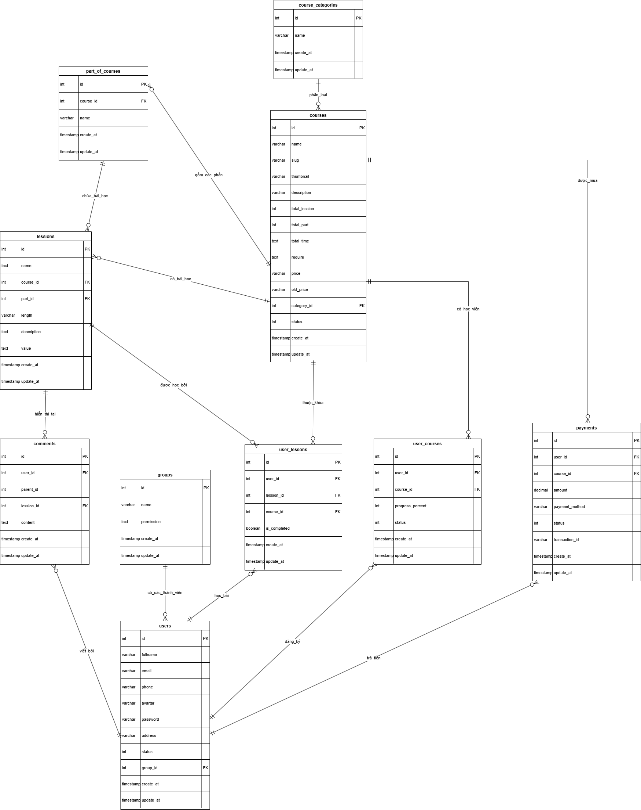

# Hệ Thống E-Learning (LearnHub)

Dự án Hệ thống E-Learning (LearnHub) là một nền tảng học trực tuyến được xây dựng với kiến trúc Backend hiện đại sử dụng **Spring Boot** kết hợp cùng cơ sở dữ liệu **PostgreSQL**. Hệ thống cho phép người dùng đăng ký tài khoản, đăng ký khóa học, xem video bài giảng (từ YouTube), theo dõi tiến độ học tập và tích hợp thanh toán (VNPay, Momo, v.v.).

## Tính năng chính

- **Xác thực & Phân quyền:**
  - Hệ thống đăng nhập/đăng ký với JWT (JSON Web Token).
  - Phân quyền người dùng (Admin, Member).
  - Mật khẩu được mã hóa an toàn bằng BCrypt.

- **Quản lý Khóa học & Bài giảng:**
  - Hiển thị danh sách khóa học (Miễn phí & Trả phí).
  - Cấu trúc khóa học rõ ràng: Khóa học -> Chương (Parts) -> Bài học (Lessons).
  - Xem bài giảng (Tích hợp nguồn video từ YouTube).
  - Quản lý danh mục khóa học.

- **Theo dõi tiến độ (Enrollment & Progress):**
  - Ghi danh khóa học (Bảng `user_courses` là nguồn duy nhất kiểm soát quyền truy cập khóa học).
  - Theo dõi tiến độ từng bài học của học viên (Bảng `user_lessons`).
  - Đánh dấu trạng thái hoàn thành bài học.

- **Giao dịch & Thanh toán:**
  - Tạo đơn hàng thanh toán khóa học.
  - Hỗ trợ đa dạng phương thức (VNPay, Momo, Chuyển khoản ngân hàng).
  - Xử lý xác nhận thanh toán và tự động cấp quyền truy cập khóa học cho học viên.

- **Tương tác:**
  - Bình luận trên từng bài giảng, hỗ trợ phản hồi (reply).

## Công nghệ sử dụng

- **Ngôn ngữ:** Java 17+
- **Framework Backend:** Spring Boot 3
- **Bảo mật:** Spring Security, JWT (JSON Web Token), BCrypt
- **Cơ sở dữ liệu:** PostgreSQL
- **ORM:** Hibernate / Spring Data JPA
- **Quản lý CSDL nâng cao:** Sử dụng Trigger, Stored Procedure, Transaction, và View (có sẵn trong thư mục `database`).

## Cấu trúc Cơ sở dữ liệu (Database Schema)

Dưới đây là sơ đồ thiết kế cơ sở dữ liệu của hệ thống:



Hệ thống được thiết kế với các bảng chính:
- `users`, `groups`: Quản lý tài khoản và phân quyền.
- `courses`, `course_categories`, `part_of_courses`, `lessions`: Quản lý nội dung khóa học.
- `user_courses`, `user_lessons`: Lưu trữ tiến độ và trạng thái ghi danh.
- `payments`: Xử lý giao dịch mua khóa học.
- `comments`: Quản lý bình luận của học viên.

## Hướng dẫn cài đặt và chạy dự án

### Yêu cầu hệ thống:
- Java JDK 17 hoặc mới hơn.
- PostgreSQL đang chạy trên máy (hoặc Docker).

### Các bước cài đặt:

1. **Clone repository:**
   ```bash
   git clone https://github.com/vanh251/dbms_project.git
   cd dbms_project
   ```

2. **Cấu hình Database:**
   Tạo một database trong PostgreSQL.
   Cập nhật thông tin kết nối (URL, username, password) trong file `src/main/resources/application.properties`.

3. **Chạy ứng dụng lần đầu:**
   Chạy ứng dụng để JPA (Hibernate) tự động tạo các bảng cơ sở dữ liệu:
   ```bash
   ./gradlew bootRun
   # hoặc
   ./mvnw spring-boot:run
   ```

4. **Seed dữ liệu:**
   Sau khi Hibernate đã tạo xong các bảng, bạn sử dụng công cụ quản lý DB (như DBeaver, pgAdmin, DataGrip) để chạy script seed dữ liệu mẫu:
   - Mở và chạy toàn bộ lệnh trong file `src/main/resources/static/database/seed_data.sql`.
   - Script này sẽ cung cấp sẵn:
     - 2 nhóm quyền (Admin, Member).
     - 4 tài khoản người dùng mẫu (Đã hash mật khẩu).
     - 6 khóa học (từ nguồn MTikCode YouTube).
     - Dữ liệu ghi danh, tiến độ, thanh toán và bình luận mẫu.

5. **Thiết lập Database nâng cao (Tùy chọn nhưng khuyến nghị):**
   Nếu bạn muốn sử dụng đầy đủ các tính năng nâng cao, hãy chạy thêm các file sau (nằm trong thư mục `src/main/resources/static/database/`):
   - `view.sql`: Tạo các view giúp truy vấn nhanh dữ liệu cho Frontend.
   - `proceduce.sql`: Các Stored Procedure xử lý nghiệp vụ.
   - `trigger.sql`: Các Trigger tự động cập nhật dữ liệu.
   - `transaction.sql`: Các kịch bản xử lý Transaction.

